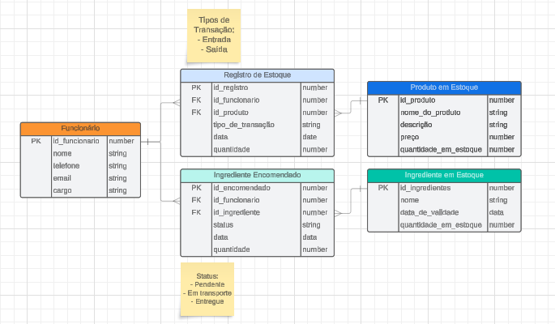

# Objetivo

Márcia deseja ter um melhor controle sobre o estoque e a produção de cookies. Ela
solicitou à Fluxo o desenvolvimento de um Sistema Web, no qual os funcionários cadastrados
pudessem registrar a entrada e saída de produtos do estoque. O sistema também deve permitir que
os funcionários interajam com uma checklist que informe quais ingredientes já foram encomendados
para as próximas produções e acompanhar seus status.

## Desenvolvimento

- [x] Modelagem do Banco de dados
- [x] Criação do Arquitetura Nest
- [x] Instalação do Prisma
- [x] Desenvolvimento do Schema
- [ ] Imports do Prisma
- [ ] Criação das entidades (resource)
- [ ] Criação das rotas (Controller)
- [ ] Desenvolvimento do banco de dados (Service)
- [ ] Testagem

## Banco de dados e Relações

### Relações

...

## Rotas e Funções

...